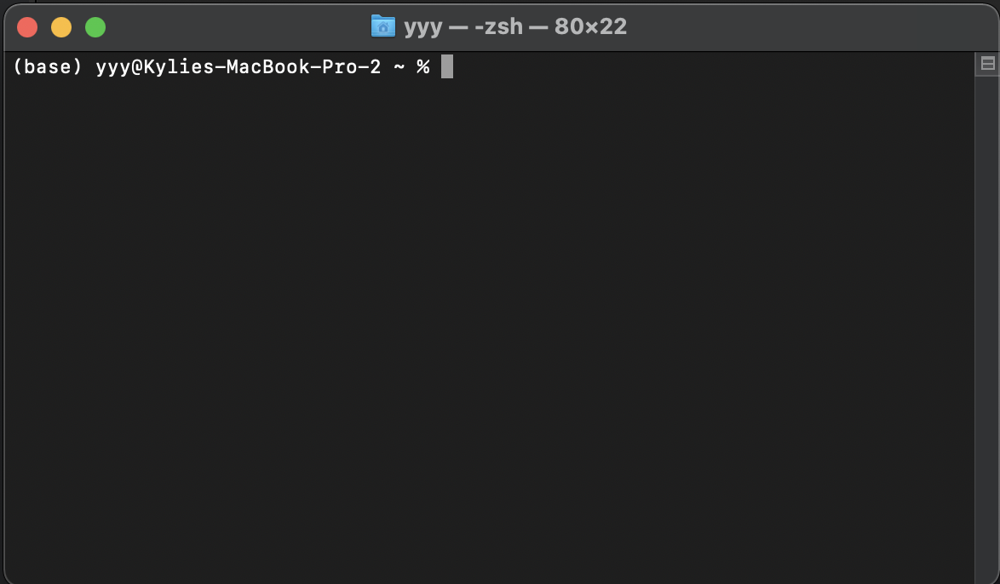

# Lecture 2: Python Basics, Types, Variables

# Sources

These notes were adapted or copied verbatim from from [Adam Hartz](https://hz.mit.edu/)'s MIT [6.145 readings](https://hz.mit.edu/catsoop/6.145/), as well as [Think Python 2e](https://greenteapress.com/wp/think-python-2e/) by [Allen Downey](http://www.allendowney.com/wp/).

# Python shell, IDEs, and terminal

One of the first things that you will encounter when you start programming is a bunch of different places to type your code. Let's start from here and clarify what is what.

## Python Shell

You may see something like this:


This is what we call a **Python shell**. In other words, each line, we can type a Python command and when we click `Enter`, the result of that command pops up (as shown above). Think of a shell as a chat, where you interact with some software.

## IDE

This is great for certain things like testing the output of a command, but usually a little too lightweight for what we want to do. For example, let's pretend our computer is a robot that listens to every single command we say (very literally). If we want the robot to do our homework, we need to give it specific commands such as:

1. Find the backpack
2. Take the agenda out of the backpack
3. Flip to the page that holds the current assignments
4. Read the text to figure out what the homework is
5. Locate the computer
6. Remove computer from backpack
7. Open the computer
8. ...

In this case, it would be easier to list each step and hand it to the robot to repeat everyday, rather than having to type in each line at every single point. This is similar to why we write files of code, known as **programs** or **scripts**. Rather than typing in things line by line in the shell, we can create a file containing all the lines, and later tell the computer to run that file!

In order to write the script, we need a place to edit the file, highlight errors, and so on. This is like using Microsoft Word or Google Docs to write an essay. In the programming word, we call this software an **IDE**, or **integrated development environment**. Sometimes, people also refer to this as a **text editor**. In this class we are using Visual Studio Code (or VSCode). It's my personal favorite, but different people have different opinions. Some like Atom, Pycharm, Repl.it, and so on. An IDE looks something like this:


## Terminal

Finally, the last (relevant) little box that we type things into looks something like this:


This is called a **terminal**, **command prompt**, **command line**, or **console**. It's an interface with the computer's operating system via a **shell** (note that a _Python shell_ allows us to interact with Python via a shell). Instead of telling Python to compute a command like `3+5`, it asks the computer to change directories (or folders), to display files and folders within a directory, to run a script, or to search for a word in a bunch of files.

## Concept Questions

1. What is the difference between a Python shell and terminal?
2. What is the difference between a Python shell and an IDE?
3. Can you think of a scenario where I would prefer to use a Python shell over writing a script?
4. Let's create a folder called `WTP` in our home directory.

# Primitive Types and Values

Python has four **primitive types**: **integers**, **floats**, **booleans**, and **strings**. Some also consider **NoneType** as a primitive as well. By primitive, we just mean these values cannot be broken down further into other types. They are the protons, neutrons, and electrons of the programming world!

In Python, these primitive types are associated with a **value**, which is the exact thing it represents. Think of phone numbers. If someone gives me their number, the type is a phone number, but the value is the exact digits in that person's number!

(Note: if you know particle physics, you know that protons and neutrons can be further broken down, but not everyone takes particle physics, so let's pretend for now that they are the building blocks of matter in the universe)

Let's discuss these primitive types:

1. `int` is a type used to represent integers. You've already experienced two integers in the example above: `2` and `3`. Integers in Python are written the way we normally write integers on the page, with one exception: commas cannot be used (we'll find out more later). So, for example, the following are integers: 2, 3, 0, -12, 10000.

2. `float` is a type used to represent real numbers. The most common way to specify a float is as a number with a decimal point. Any number with a decimal point in it is a float (for example, 5.0 or 6.2831 or 3.).

3. `bool` is used to represent the boolean values. In Python, these are represented as `True` and `False`.

4. `string` is used to represent a sequence of characters. We use single quotes (`'`) or double quotes (`"`) around some text to represent a string.

5. `NoneType` is a type with a single value: `None`. `None` is a special kind of object that is designed to represent the absence of a value. This might seem weird for now (indeed, the number 0 felt weird to many civilizations for many centuries!), but it should come to make more sense with time.

Some note about the `float`:
You might wonder why this type is not called "real" or "exact" or "decimal" (`float` seems like a pretty bizarre name, indeed!). The reason is that these values are represented in a computer in a representation called **floating point**. We won't go into detail about this representation in this class, but it is worth noting a few things:

- This representation is used by almost all modern programming languages, and we got that way because it has some nice features.
- However, it is worth noting that this representation cannot exactly represent all real numbers. As such, we will sometimes need to keep in mind that float objects are approximations of the numbers we actually want.
- To see an example of this behavior, try running 0.1 + 0.1 + 0.1. you'll see an unexpected result!

# Basic Types Examples

Primitives

```
True    # boolean
2.99    # float
None    # NoneType
3       # int
3.      # float
0       # int
```

Combinations

```
3. + 1      # float
25 - 16.    # float
-5 - 15     # int
32 > 335    # boolean
94.2 == 35  # boolean
4 == 4.     # boolean
34 / 322    # float
322 % 34    # int
```

# Print Statements

Before we move on to doing fancy things with these values, I wanted to mention the `print` statement. In Python 3, we type in `print("something")` and this would print `something` to the console.

It's a tradition in the programming word to print `"Hello World"` as your first piece of code. Let's create a script to do this!

1. Open the `WTP` folder in VSCode
2. Create a new python file
3. Type in `print("Hello World!")`
4. Save as `hello.py`
5. Let's run the program in terminal using the command `python3 hello.py` (making sure you are in the `WTP` directory)
