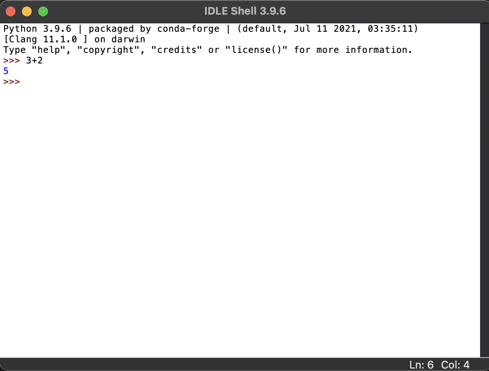
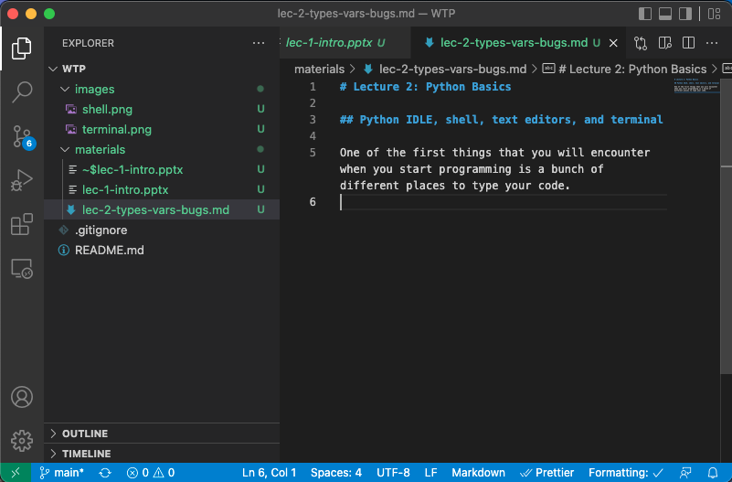
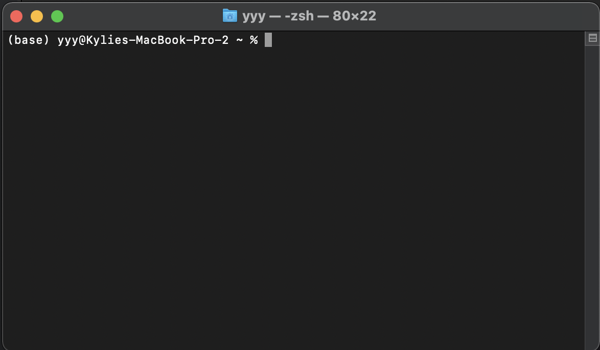

# Lecture 2: Python Basics, Types, Variables

# Sources

These notes were adapted or copied verbatim from from [Adam Hartz](https://hz.mit.edu/)'s MIT [6.145 readings](https://hz.mit.edu/catsoop/6.145/), as well as [Think Python 2e](https://greenteapress.com/wp/think-python-2e/) by [Allen Downey](http://www.allendowney.com/wp/).

# Python shell, IDEs, and terminal

One of the first things that you will encounter when you start programming is a bunch of different places to type your code. Let's start from here and clarify what is what.

## Python Shell

You may see something like this:


This is what we call a **Python shell**. In other words, each line, we can type a Python command and when we click `Enter`, the result of that command pops up (as shown above). Think of a shell as a chat, where you interact with some software.

## IDE

This is great for certain things like testing the output of a command, but usually a little too lightweight for what we want to do. For example, let's pretend our computer is a robot that listens to every single command we say (very literally). If we want the robot to do our homework, we need to give it specific commands such as:

1. Find the backpack
2. Take the agenda out of the backpack
3. Flip to the page that holds the current assignments
4. Read the text to figure out what the homework is
5. Locate the computer
6. Remove computer from backpack
7. Open the computer
8. ...

In this case, it would be easier to list each step and hand it to the robot to repeat everyday, rather than having to type in each line at every single point. This is similar to why we write files of code, known as **programs** or **scripts**. Rather than typing in things line by line in the shell, we can create a file containing all the lines, and later tell the computer to run that file!

In order to write the script, we need a place to edit the file, highlight errors, and so on. This is like using Microsoft Word or Google Docs to write an essay. In the programming word, we call this software an **IDE**, or **integrated development environment**. Sometimes, people also refer to this as a **text editor**. In this class we are using Visual Studio Code (or VSCode). It's my personal favorite, but different people have different opinions. Some like Atom, Pycharm, Repl.it, and so on. An IDE looks something like this:


## Terminal

Finally, the last (relevant) little box that we type things into looks something like this:


This is called a **terminal**, **command prompt**, **command line**, or **console**. It's an interface with the computer's operating system via a **shell** (note that a _Python shell_ allows us to interact with Python via a shell). Instead of telling Python to compute a command like `3+5`, it asks the computer to change directories (or folders), to display files and folders within a directory, to run a script, or to search for a word in a bunch of files.

## Concept Questions

1. What is the difference between a Python shell and terminal?
2. What is the difference between a Python shell and an IDE?
3. Can you think of a scenario where I would prefer to use a Python shell over writing a script?
4. Let's create a folder called `WTP` in our home directory.

# Primitive Types and Values

Python has four **primitive types**: **integers**, **floats**, **booleans**, and **strings**. Some also consider **NoneType** as a primitive as well. By primitive, we just mean these values cannot be broken down further into other types. They are the protons, neutrons, and electrons of the programming world!

In Python, these primitive types are associated with a **value**, which is the exact thing it represents. Think of phone numbers. If someone gives me their number, the type is a phone number, but the value is the exact digits in that person's number!

(Note: if you know particle physics, you know that protons and neutrons can be further broken down, but not everyone takes particle physics, so let's pretend for now that they are the building blocks of matter in the universe)

Let's discuss these primitive types:

1. `int` is a type used to represent integers. You've already experienced two integers in the example above: `2` and `3`. Integers in Python are written the way we normally write integers on the page, with one exception: commas cannot be used (we'll find out more later). So, for example, the following are integers: 2, 3, 0, -12, 10000.

2. `float` is a type used to represent real numbers. The most common way to specify a float is as a number with a decimal point. Any number with a decimal point in it is a float (for example, 5.0 or 6.2831 or 3.).

3. `bool` is used to represent the boolean values. In Python, these are represented as `True` and `False`.

4. `string` is used to represent a sequence of characters. We use single quotes (`'`) or double quotes (`"`) around some text to represent a string.

5. `NoneType` is a type with a single value: `None`. `None` is a special kind of object that is designed to represent the absence of a value. This might seem weird for now (indeed, the number 0 felt weird to many civilizations for many centuries!), but it should come to make more sense with time.

Some note about the `float`:
You might wonder why this type is not called "real" or "exact" or "decimal" (`float` seems like a pretty bizarre name, indeed!). The reason is that these values are represented in a computer in a representation called **floating point**. We won't go into detail about this representation in this class, but it is worth noting a few things:

- This representation is used by almost all modern programming languages, and we got that way because it has some nice features.
- However, it is worth noting that this representation cannot exactly represent all real numbers. As such, we will sometimes need to keep in mind that float objects are approximations of the numbers we actually want.
- To see an example of this behavior, try running 0.1 + 0.1 + 0.1. you'll see an unexpected result!

# Basic Types Examples

Primitives

```
True    # boolean
2.99    # float
None    # NoneType
3       # int
3.      # float
0       # int
```

Combinations

```
3. + 1      # float
25 - 16.    # float
-5 - 15     # int
32 > 335    # boolean
94.2 == 35  # boolean
4 == 4.     # boolean
34 / 322    # float
322 % 34    # int
```

# Print Statements

Before we move on to doing fancy things with these values, I wanted to mention the `print` statement. In Python 3, we type in `print("something")` and this would print `something` to the console.

It's a tradition in the programming word to print `"Hello World"` as your first piece of code. Let's create a script to do this!

1. Open the `WTP` folder in VSCode
2. Create a new python file
3. Type in `print("Hello World!")`
4. Save as `hello.py`
5. Let's run the program in terminal using the command `python3 hello.py` (making sure you are in the `WTP` directory)

# Algebraic Expressions

We can combine the basic types using **operators**. Previously, we've already seen the `+` operator. Let's explore some other mathematical operators we can use:

- `+` denotes addition
- `-` denotes subtraction
- `*` denotes multiplication
- `/` denotes division
- `i**j` denotes exponentiation

## Order of Operations

If you've learned about order of operations, PEMDAS, it still holds in programming. In case not, we'll briefly cover the ordering here:

- Parentheses have the highest precedence and are evaluated first
- Exponentiation is next
- Multiplication and Division follow exponentiation
- Addition and Subtraction come last

For example, an expression like `5+(2*(4-1)+4**3)` would folloow the following order:

1. We evaluate what is inside the parentheses first: `2*(4-1)+4**3`.
2. We must also apply PEMDAS here as well. Evaluating the parentheses, we get: `2*3+4**3`.
3. Now, evaluating the exponent, we get: `2*3+64`.
4. Evaluating the multiplication, we get: `6+64`.
5. Finally, we perform the addition here, and get `70` for the final value of the parentheses.
6. For the value of the whole expression, we get `5+70`, which gives us then `75`.

## Strings

We cannot perform mathematical operations on strings, even if they look like numbers. For example `"stringa"-"stringb"`, `"100"/"20"` and `"4"*"2"` are not valid expressions. However, there are two exceptions: `+` and `*`.

The `+` operator allows us to join strings together. This is known as **string concatenation**. For example, `"Hello " + "World"` would give us `"Hello World"` (note that there is a space at the end of the first string... if it were just `"Hello"+"World"`, we would get `"HelloWorld"`)

The `*` operator allows us to repeat a string "multiplied" by an integer. For example, `"example"*3` would produce `"exampleexampleexample"`. We can treat `"example"*3` as `"example"+"example"+"example"`, but with less to type out, which will be a recurring theme in computer science. Usually, the less to type, the less code there is to contain a mistake!

## Concept Questions

1. What would `7+8` produce?
2. What about `7.+8`? How is this result different from the one above?
3. What would happen if we tried `7+"8"`?
4. What about `"7"+"8"`?

# Converting Between Types

Just a note, we can convert between types of numbers and strings.

```
int(7.8)  # 7
float(6)  # 6.0
str(6.0)  # "6.0"
int("2")  # 2
float("7.8")  # 7.8
int("tomato")  # error
int("7.8")  # error
float("6")  # 6.0
```

# Boolean Expressions

A Boolean expression resolved to either true or false. In Python, this is an object of type `bool`, and the value is either `True` or `False`. For example. `5 == 5` returns `True`, but `5 == 6` returns `False`.

As we might guess, the `==` is an operator that determines whether or not two values are equal to one another, and results in a boolean value.

The `==` operator is a relational operator, which operates on arbitrary values and produce bool objects. Other relational operators include:

- `==` ("is equal to") compares two operands and produces `True` if they are equal, and `False` otherwise.
- `!=` ("is not equal to") compares two operands and produces `True` if they are not equal, and `False` otherwise.
- `>` ("is greater than") compares two operands and produces `True` if the first is greater than the second, and `False` otherwise.
- `<` ("is less than") compares two operands and produces `True` if the first is less than the second, and `False` otherwise.
- `>=` ("is greater than or equal to") compares two operands and produces `True` if the first is greater than or equal to the second, and `False` otherwise.
- `<=` ("is less than or equal to") compares two operands and produces `True` if the first is less than or equal to the second, and `False` otherwise.

There are also three operators that only operate on Boolean values:

- `and` produces `True` if both of its operands are `True`, and produces `False` otherwise (for example, `True and True` produces `True`; but `False and True` produces `False`).
- `or` produces `True` if at least one of its operands is `True`, and produces `False` otherwise (for example, `True or True` produces `True`; and `True or False` also produces `True`; but `False or False` produces `False`).
- `not` is a unary operator (it has only one operand) that produces `True` if its operand is `False`, and `False` if its operand is `True` (for example, `not False` produces `True`; and `not True` produces `False`.

Sounds pretty straightforward right? When will we ever need to know if `False or False` is `False`? That doesn't sound like it's very useful... However, in future chapters, we will see that there are more complex expressions that reduce to `True` and `False`, and the computer will rely on those expressions to decide how to proceed!

# Expression Practice

```
5 + 3 - 16      # -8
25 // 4         # 6
8+4*2           # 16
(8+4)*2         # 24
3 ** 5          # 243
3.0 ** 5        # 243.0
3/2             # 1.5
16.3 % 16       # 0.3

True or False       # True
True and False      # False
3 > 4 or 3 == 3     # True
not False           # True
not (4 > 3 and 100 > 6)     # False
4 == 2 + 2          # True
```

# Variables and Assignment

Up to now, we've only really looked at expressions. However, sometimes it's useful to **assign** a name to a value. We do this using **variables**.

Let's use an example:

```
x = 2 + 2
```

Here, we are assigning the result of `2+2` to the value `x`. So, if we ask the console what `x` is, we see that the result is `4`.

Let's try to explain this with some algebra. Ok so if we say `x = 2+2`, then we are basically setting the variable `x` as `4`. Now, if we type in `x+5`, we replace the name with the value, and this is the same as `4+5`, which returns `9`. We can even use another assignment operator with a different variable, `y = x+5`, and now, we have a variable `x` that equals `5` and a variable `y` that equals `9`.

Note, the `=` and `==` might seem similar, but the former is an operator that assigns a value to a variable, and the latter is an operator that checks whether two values are equal.

## Concept questions

1. What if we had set `x = x+5`? Do you think this is allowed? If so, what would `x` be equal to?

# Variable Names

In our example above, we could have replace `x` with some other name, such as `a` or `number` or `elephant`. Usually, we want to choose variable names that are somewhat descriptive, but short enough to type.

For example, can anyone tell me what this code is trying to do:

```
a = 6.28318
b = 2

c = a * b
d = 1 / 2 * a * b ** 2

e = 4 * d
f = 2 / 3 * a * b ** 3
```

In contrast, let's use some more descriptive variable names:

```
tau = 6.28318
radius = 2

circle_circumference = tau * radius
circle_area = 1 / 2 * tau * radius ** 2

sphere_surface_area = 4 * circle_area
sphere_volume = 2 / 3 * tau * radius ** 3
```

That makes the code a lot easier to understand right? It is possible to go a little too far, and then the variables are just annoying to type out:

```
the_ratio_between_the_circumference_and_the_radius_of_a_circle = 6.28318
the_radius_of_the_shapes_for_which_we_want_to_compute_values = 2
```

## Rules for variable names:

- Variable names must begin with an alphabetical character or the underscore character
- Variable names cannot being with a number
- Variable names must be comprised of alphanumeric characters and underscores (`A-Z`, `a-z`, `0-9`, and `_`). This means no special characters such as `*`, `!`, and so on!
- Variable names are case-sensitive. This means that `wtp`, `WTP`, and `Wtp` are all different variables

## Examples of variable names:

```
# valid variable names
my_wtp_variable = "hello"
mywtpvariable = "hello"
myWtpVariable = "hello"
_my_wtp_variable = "hello"
WTPVAR = "hello"
wtpvar12345 = "hello"

# non-valid variable names
123var = "hello"
wtp-variable = "hello"
my wtp variable = "hello"
```

# Variables Example

```
a = 7
c = 9
a = 4
if a > 6:
    b = 9
else:
    b = 10

if a > 7:
   d = 3
if a > 3:
   d = 2
else:
    d = 1
```

What are the values of `a`, `b`, `c`, and `d`?

Answer:

```
a = 4
b = 10
c = 9
d = 2
```

# Comments

We can add comments to our code to help ourselves/others understand the code better. These do not do anything functional to our code, but they allow us to, well, add comments! In Python, comments are denoted by a `#` symbol. For example, we can write this:

```
x = 2 + 2  # sets x to 4
```

The comment is just for the reader to know that that line is setting `x` to `4`, but the actual function of the code does not change.

# Debugging

We're human. We usually make mistakes. When things don't go the way we want them to, we call these **bugs** in our code. The process of fixing these bugs is known as **debugging**. Sometimes, 10% of your time programming is actually coding and the other 90% is trying to hunt down mysterious bugs. :')

Debugging is usually not an easy task. However, there are a few tools to help you!

First, how do you know there's a bug? Usually, the most common way is that the script throws an error, or you do not get the output that you want! When you get an error, usually that is good, and we can use it to see where we made a mistake.

For example, let's say the fire alarm in your house is going off. This is the equivalent of your code showing an error message. Now, let's say you had a smart-house that told you, "There is smoke coming from the kitchen on the first floor." Naturally, you (or the firemen) would check the kitchen on the first floor, right?

When we have bugs in our code, usually we get an error message that tells us exactly what is going on. That will be the first place to start the debugging hunt.

Now, let's say we don't have any errors but we know our code is failing because we aren't getting the result that we want. Let's say we have a fire alarm going off, but no smart-house, so we aren't sure where it's coming from. We might check all the rooms in the house to see what's going on in there! Similarly, we might want to see if our code at various steps is returning the result that we want it to. We can take a look at what's going on by using a debugger (which is what you probably should officially use)... or... by using a bunch of `print` statements (which is what most Python programmers actually do).

We will grow to love/hate debugging as we start writing code!

There are three kinds of errors that occur in a program:

1. **Syntax error**: “Syntax” refers to the structure of a program and the rules about that structure. For example, parentheses have to come in matching pairs, so `(1 + 2)` is legal, but `8)` is a syntax error. If there is a syntax error anywhere in your program, Python displays an error message and quits, and you will not be able to run the program. During the first few weeks of your programming career, you might spend a lot of time tracking down syntax errors. As you gain experience, you will make fewer errors and find them faster.
2. **Runtime error**: The second type of error is a runtime error, so called because the error does not appear until after the program has started running. These errors are also called exceptions because they usually indicate that something exceptional (and bad) has happened. Runtime errors are rare in the simple programs you will see in the first few chapters, so it might be a while before you encounter one.
3. **Semantic error**: The third type of error is “semantic”, which means related to meaning. If there is a semantic error in your program, it will run without generating error messages, but it will not do the right thing. It will do something else. Specifically, it will do what you told it to do. Identifying semantic errors can be tricky because it requires you to work backward by looking at the output of the program and trying to figure out what it is doing.
